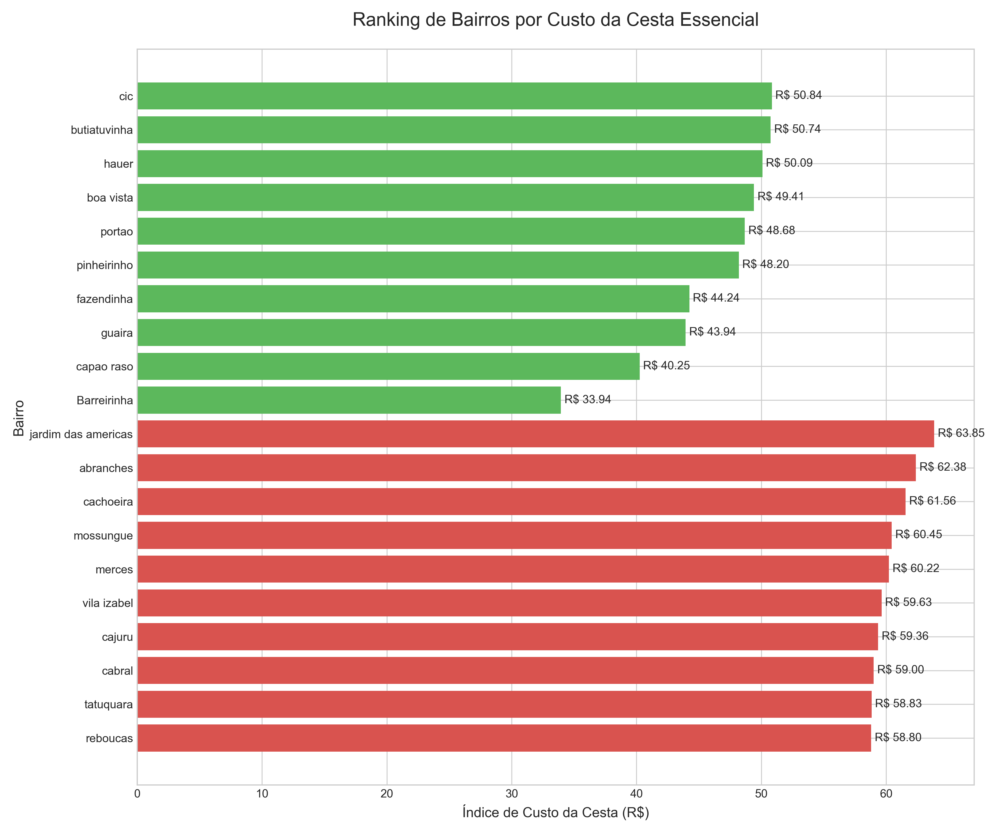
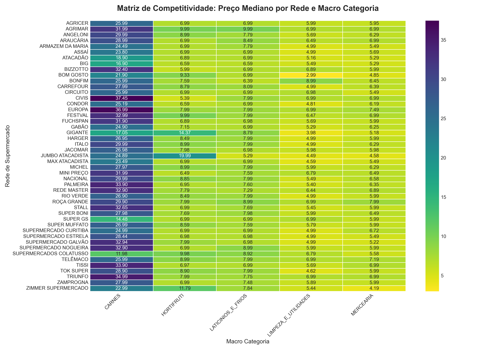
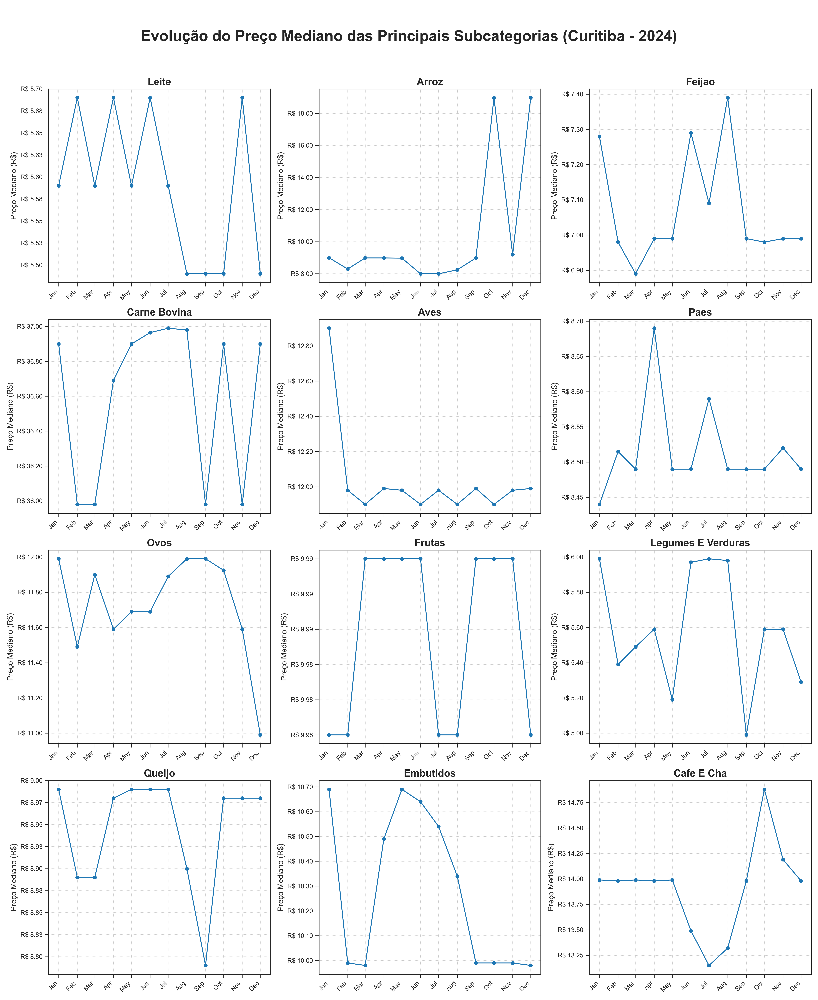
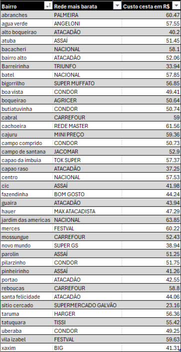

# 🗺️🛒💰Onde é Mais Barato Comprar em Curitiba: Análise dos Preços no Varejo por Bairro com Dados Públicos

[**English Version 🇬🇧**](#-where-to-shop-cheaper-in-curitiba-neighborhood-grocery-price-analysis-based-on-public-data)

## 📖 Descrição do Projeto

Este projeto consiste em uma análise exploratória de dados sobre a dispersão de preços no setor de varejo alimentício da cidade de Curitiba, utilizando dados públicos do programa "Clique Economia" referentes ao ano de 2024. O objetivo principal é transformar mais de 700.000 registros de preços brutos em insights acionáveis que possam empoderar o consumidor em suas decisões de compra.

O trabalho explora a dinâmica de preços através de três eixos principais: **geográfico** (comparando bairros), **competitivo** (comparando redes de supermercado) e **temporal** (analisando a evolução dos preços ao longo dos meses).

---

## 🎯 Objetivos

* Mapear a variação de custos de uma cesta de consumo representativa entre os diferentes bairros.
* Comparar o posicionamento de preço das principais redes de supermercado.
* Identificar as categorias de produtos com maior volatilidade de preços.
* Sintetizar os achados em um guia prático para o consumidor curitibano.

---

## 🛠️ Metodologia e Pipeline de Dados

O projeto foi desenvolvido em Python e seguiu um robusto pipeline de ETL (Extração, Transformação e Carga) para garantir a qualidade e a consistência dos dados. As principais etapas foram:
1.  **Extração:** Automação da coleta de centenas de arquivos CSV diários do portal de dados abertos.
2.  **Limpeza de Dados:** Tratamento de valores nulos, correção de tipos de dados e remoção de duplicatas.
3.  **Enriquecimento e Normalização:**
    * **Normalização Geográfica:** Extração e padronização dos bairros de Curitiba.
    * **Padronização de Redes:** Unificação de nomes variantes de uma mesma rede de supermercado.
    * **Sistema de Categorização:** Desenvolvimento de um classificador hierárquico (`categoria_n1`, `categoria_n2`) baseado em um sistema de regras de dupla camada para classificar mais de 700.000 descrições de produtos.

---

## 📈 Amostra dos Resultados

A análise revelou padrões claros sobre o comportamento dos preços na cidade. Abaixo estão alguns dos principais gráficos e resultados gerados.

#### Ranking de Bairros por Custo da Cesta Essencial
*Este gráfico mostra os 10 bairros mais caros e os 10 mais baratos para uma cesta de produtos padrão.*

#### Matriz de Competitividade: Preço por Rede e Categoria
*Este mapa de calor revela o posicionamento estratégico de cada supermercado, mostrando quais são mais competitivos em cada categoria principal de produtos.*

#### Evolução Temporal das Principais Subcategorias
*Este painel mostra a jornada de preços das 12 subcategorias mais relevantes ao longo de 2024, resolvendo o problema de diferentes escalas de preço.*

#### Guia Prático: A Rede Mais Barata por Bairro
*Esta imagem mostra uma amostra da tabela final gerada, o "guia de compras", que sintetiza a análise e oferece uma recomendação direta ao consumidor sobre onde encontrar a cesta mais barata em diferentes bairros.*

---

## 🚀 Como Executar o Projeto

1.  Clone este repositório.
2.  Crie um ambiente virtual (`python -m venv .venv` e ative-o).
3.  Instale as dependências: `pip install -r requirements.txt`.
4.  Coloque os arquivos de dados brutos necessários na pasta `/dados`.
5.  Execute os scripts Python na ordem numérica: `01_...`, `02_...`, `03_...`.
6.  Os resultados (tabelas e gráficos) serão salvos na pasta `/resultados`.

---

## 👨‍💻 Autor

**Lucas Alejandro Terres**

* **LinkedIn:** `https://www.linkedin.com/in/lucasalejandroterres/`
* **Email:** `lucasalejandroterres@gmail.com`

&nbsp;
&nbsp;

---
---

&nbsp;
&nbsp;

# 🗺️🛒💰Where to Shop Cheaper in Curitiba: Neighborhood Grocery Price Analysis Based on Public Data

[**Portuguese Version 🇧🇷**](#️-onde-é-mais-barato-comprar-em-curitiba-análise-dos-preços-no-varejo-por-bairro-com-dados-públicos)

## 📖 About The Project

This project consists of an exploratory data analysis of price dispersion in the food retail sector of Curitiba, Brazil, using public data from the "Clique Economia" program for the year 2024. The main goal is to transform over 700,000 raw price records into actionable intelligence that can empower consumers in their purchasing decisions.

The work explores price dynamics across three main axes: **geographical** (comparing neighborhoods), **competitive** (comparing supermarket chains), and **temporal** (analyzing price evolution over the months).

---

## 🎯 Key Objectives

* Map the cost variation of a representative consumer basket across different city neighborhoods.
* Compare the price positioning of the main supermarket chains, identifying their strategies by product category.
* Identify the product categories with the highest price volatility.
* Synthesize the findings into a practical guide for the Curitiba consumer.

---

## 🛠️ Methodology & Data Pipeline

The project was developed in Python and followed a robust ETL (Extract, Transform, Load) pipeline to ensure data quality and consistency. The main steps were:
1.  **Extraction:** Automation of the collection of hundreds of daily CSV files from an open data portal.
2.  **Data Cleaning:** Handling of null values, correction of data types, and removal of duplicates.
3.  **Enrichment and Normalization:**
    * **Geographic Normalization:** Extraction and standardization of Curitiba's neighborhoods.
    * **Chain Standardization:** Unification of variant names for the same supermarket chain.
    * **Product Categorization System:** Development of a two-tier hierarchical classifier (`category_level_1`, `category_level_2`) based on a sophisticated rule-based dictionary to classify over 700,000 product descriptions.

---

## 📈 Results Showcase

The analysis revealed clear patterns in the city's pricing behavior. Below are some of the key visualizations generated.

#### Neighborhood Ranking by Cost of the Essential Basket
*This chart shows the 10 most and least expensive neighborhoods for a standard basket of goods.*

#### Competitiveness Matrix: Price by Chain and Category
*This heatmap reveals the strategic positioning of each supermarket, showing which are more competitive in each main product category.*

#### Price Evolution of Main Subcategories
*This dashboard shows the price journey of the 12 most relevant subcategories throughout 2024, solving the problem of different price scales.*

#### Consumer Guide: Cheapest Chain by Neighborhood
*This image shows a sample of the final output table, the "shopping guide," which synthesizes the analysis and offers a direct recommendation to consumers on where to find the cheapest essential basket in different neighborhoods.*

---

## 🚀 How to Run

1.  Clone this repository.
2.  Create a virtual environment: `python -m venv .venv` and activate it.
3.  Install the dependencies: `pip install -r requirements.txt`.
4.  Place the necessary input data files in the `/dados` folder.
5.  Run the analysis scripts located in the `/codigo` folder in their numerical order.
6.  The results (tables and charts) will be saved in the `/resultados` folder.

---

## 👨‍💻 Author

**Lucas Alejandro Terres**

* **LinkedIn:** `https://www.linkedin.com/in/lucasalejandroterres/`
* **Email:** `lucasalejandroterres@gmail.com`
